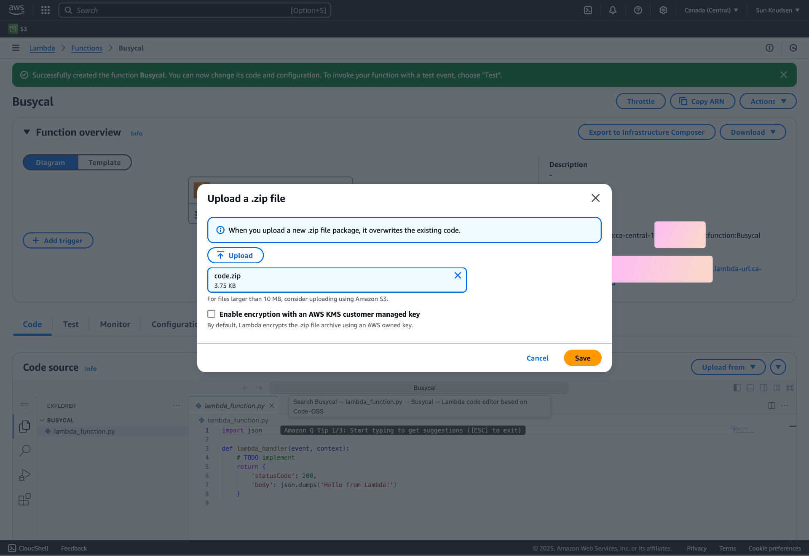

# Busycal

## Busycal is used to privately combine and share [text/calendar](https://en.wikipedia.org/wiki/ICalendar) calendars revealing busy time blocks within user-configurable workweek (sharing as little as possible).

For example, I use Busycal to privately share my personal and [Superbacked](https://superbacked.com/) [Proton](https://proton.me/) calendars with [nimble bubble](https://nimblebubble.com/) which uses not-so-privacy-conscious Microsoft 365 (see screenshot below).

**But can’t Proton already do this?** Yes, but… by default, Busycal will only combine calendar items up to one week in the past, Monday to Friday and from 9AM to 5PM (all of which is [user-configurable](#edit-lambda_functionpy)) sharing as little as possible while allowing for convenient calendar sharing.

**But doesn’t Outlook (and many others, including Proton) only sync text/calendar calendars every few hours?** Sadly, yes, but… there is nothing we can do about this. Thankfully, apps such as [Calendar](https://en.wikipedia.org/wiki/Calendar_(Apple)) on macOS allow users to configure auto-refresh to every 5 minutes.


## Usage guide

### Create `urls.txt`

Create `urls.txt` and add shared calendar URLs (one per line).

### Edit `lambda_function.py`

Open `lambda_function.py` and edit user-configurable variables.

### Run locally

#### Step 1: install dependencies

> Heads-up: replace `3.13` with current Lambda Python runtime version (if applicable).

```console
$ mkdir -p python/lib/python3.13/site-packages

$ pip3.13 install --requirement requirements.txt --target python/lib/python3.13/site-packages
```

#### Step 2: run script

> Heads-up: replace `3.13` with current Lambda Python runtime version (if applicable).

```console
$ export PYTHONPATH=python/lib/python3.13/site-packages:$PYTHONPATH

$ python3 lambda_function.py
```

### Host using AWS Lambda

#### Step 1: install dependencies

> Heads-up: replace `3.13` with current Lambda Python runtime version.

```console
$ mkdir -p python/lib/python3.13/site-packages

$ pip3.13 install --requirement requirements.txt --target python/lib/python3.13/site-packages
```

#### Step 2: create `code.zip`

```console
$ zip -r code.zip lambda_function.py urls.txt
```

#### Step 3: create `layer.zip`

```console
$ zip -r layer.zip python
```

#### Step 4: create layer


#### Step 5: create function


#### Step 6: upload code



#### Step 7: add layer


#### Step 8: edit basic settings

> Heads-up: set timeout to 30 seconds.


#### Step 9: copy function URL


#### Step 10: share copied function URL